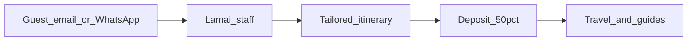

# Lamai Africa Safaris — Internal Operations Workspace

**Product requirements document (v1)**  
**Status:** Requirements only. No app, UI, or backend work until a new admin dashboard template is supplied.  
**Company site:** [lamaisafaris.com](https://lamaisafaris.com/)

---

## 1. Why this product exists

Lamai Africa Safaris is a small Arusha operator that sells **custom Tanzania trips**, not a fixed catalog checkout. Guests arrive by contact form, email, or WhatsApp-style phone. Staff then design a tailored itinerary by hand.

About **five people** currently handle that work in inboxes and chats. There is no shared picture of:

- which enquiries are live
- who owns each trip file
- what the next follow-up is
- whether the **50% deposit** or **90-day balance** is still outstanding

This product is an **internal enquiry-to-operations workspace** for that team. It is not the public website, not an accounting ledger, and not a lodge/supplier inventory.

---

## 2. Company facts the tool must respect

Public facts from the website, contact page, FAQ, and published Terms & Conditions. The workspace should use these as the company profile defaults; staff must still be able to edit them in admin settings.

| Item                   | Value                                                                |
| ---------------------- | -------------------------------------------------------------------- |
| Legal name             | Lamai Africa Safaris Ltd                                             |
| Office                 | House #64 Kishori, Moshono, Arusha, Tanzania                         |
| Postal                 | P.O. Box 3191, Arusha                                                |
| Phone / WhatsApp-style | +255 768 506 258                                                     |
| Email                  | [info@lamaisafaris.com](mailto:info@lamaisafaris.com)                |
| TIN                    | 173-172-885                                                          |
| Timezone               | Africa/Dar_es_Salaam                                                 |
| Founders / guides      | Mody Gichero and Ally                                                |
| Heritage               | Hadzabe and Datoga; safaris are personal, not mass-market            |
| How guests book today  | Contact form, email, or phone. **No self-serve cart** on the website |

**Product they sell:** fully tailored itineraries. Guests can change destinations, dates, lodges (bush camp through luxury), activities, budget, and travel style. Typical destinations called out on the site: Serengeti, Ngorongoro, Kilimanjaro, plus walking / cultural / Hadza days.

**Money (public T&Cs / FAQ):**

- 50% non-refundable deposit per person to book
- Balance due 90 days before departure
- Wire transfers
- Cancel more than 90 days before departure: 50% of trip price
- Cancel 90 days or less before departure: 100% of trip price
- Confirmation can override these terms if staff agree it in writing

Do not store or display any seed, demo, or recovery passwords in this product or in this document.

---

## 3. Problem statement

When a guest writes in, the trip only exists if someone remembers it. Follow-ups live in personal WhatsApp threads. Payment milestones are not visible next to the itinerary. Owners change informally. By the time travel is close, it is easy to miss a deposit, a balance, a park-fee reminder, or a guest who went quiet.

v1 exists so the five staff members can open one workspace and answer:

1. What is live right now?
2. Who owns it?
3. What is due today?
4. Has the deposit / balance been marked received?

---

## 4. Users and access

Two **permission** roles only in v1:

| Role            | Who                                                      | What they can do                                                                                                                                                    |
| --------------- | -------------------------------------------------------- | ------------------------------------------------------------------------------------------------------------------------------------------------------------------- |
| **Super Admin** | Owner / operator (typically Mody or a designated deputy) | Everything Staff can do, plus staff accounts, company settings, reference lists, payment recording, and simple reports                                              |
| **Staff**       | The rest of the ~5-person team                           | Sign in, work enquiries, clients, follow-ups, and the pipeline. They can see payment status on a trip they work, but they do not manage users, settings, or reports |

**Work labels** (not extra permission locks in v1): Sales, Reservations, Operations, Guide. A staff member can have a label so the team knows who does what. Labels do not hide screens unless a later PRD says so.

v1 sign-in is a simple staff username + password issued by Super Admin. No guest login, no Clerk, no Google/social login, no public self-registration.

When Super Admin adds staff, the workspace issues a username and a one-time password. Staff must change that password on first sign-in. Super Admin can reset a staff password. Sessions should expire on a working-day timescale (about one work day).

---

## 5. In scope for v1

| Area                   | Staff need to                                                                                                                                  |
| ---------------------- | ---------------------------------------------------------------------------------------------------------------------------------------------- |
| Sign-in                | Log in, log out, change their own password                                                                                                     |
| Clients                | Create / find a guest or travel party (name, email, phone/WhatsApp, nationality, notes)                                                        |
| Enquiries / trip files | Open a file from an inbound contact, attach it to a client, capture what they asked for, keep the tailored itinerary notes as the trip evolves |
| Pipeline               | Move a file through stages without losing owner or next action                                                                                 |
| Follow-ups             | See what is due today / overdue; log a call, WhatsApp, or email; set the next follow-up                                                        |
| Payment milestones     | On a booked trip, see deposit (50%) and balance (due 90 days before departure); Super Admin marks received                                     |
| Simple reports         | Super Admin: counts by stage, overdue follow-ups, outstanding deposits/balances                                                                |
| Admin settings         | Super Admin: staff list, company profile, destination/style reference lists                                                                    |

v1 is a **daily operations board**, not a document factory. Itinerary text can live as structured notes and a date/lodge outline. Generating a branded PDF quote is not required for v1 unless the new UI template already makes that trivial.

---

## 6. Out of scope for v1

- Public website or replacing [lamaisafaris.com](https://lamaisafaris.com/)
- Guest self-booking / checkout cart
- Accounting, invoicing, tax, or a general ledger
- Supplier or lodge inventory / contracting stock
- Park-fee APIs, flight booking, or payment-gateway collection
- Clerk, social, or Google-account login
- Demo / seed safari trips
- Multi-company or white-label use
- Mobile-native apps (a usable phone browser layout is enough)
- The previous shadcn-admin / Apps Script SPA is **not** carried forward by default

---

## 7. Enquiry-to-operations workflow

This is the real Lamai loop the screens must support.

1. **Arrive.** Guest writes via web form, email, or phone/WhatsApp. Staff create an enquiry (or the later implementation may ingest the form; v1 can start with manual entry).
2. **Qualify.** Capture pax, dates (or flexibility), destinations of interest, travel style, budget band, and how they found Lamai.
3. **Design.** Staff (often Mody/Ally) draft a tailored itinerary: nights, parks, lodge style, activities (game drives, walking, cultural/Hadza, Kilimanjaro). This is a conversation, not a SKU pick-list.
4. **Quote.** Send the proposal outside the tool if needed (email/WhatsApp). Mark the file as quoted and set the next follow-up.
5. **Book.** Guest accepts. Super Admin records the 50% deposit. File becomes a confirmed trip. Balance due date is **departure minus 90 days**.
6. **Operate.** Closer to travel: remaining balance, guest details, guide assignment, lodge confirmations as notes. After travel, mark complete. Lost/declined files are archived, not deleted.

Default pipeline stages:

| Stage       | Meaning                                                   |
| ----------- | --------------------------------------------------------- |
| New         | Inbound, not yet qualified                                |
| Qualifying  | Gathering dates, pax, style, budget                       |
| Designing   | Building the tailored itinerary                           |
| Quoted      | Proposal sent; waiting on guest                           |
| Option held | Informal hold / “thinking about it” with a follow-up date |
| Deposit due | Guest accepted; 50% not yet marked received               |
| Confirmed   | Deposit received; trip is on the books                    |
| Balance due | Inside the 90-day window and balance still outstanding    |
| Travelling  | Trip in progress                                          |
| Completed   | Guest has travelled                                       |
| Lost        | Declined, went silent, or cancelled                       |

A file can skip stages (e.g. a returning guest who already knows the itinerary). Staff must still set an **owner** and a **next follow-up** whenever the file is not Completed or Lost.

---

## 8. Data the website implies we must capture

Fields below are the v1 enquiry/trip file. Keep them short enough for non-technical staff.

### 8.1 Client / travel party

- Full name
- Email
- Phone / WhatsApp. must have a drop doen for all country codes then the rest of the number digits.
- Nationality / country of residence
- Party type (solo, couple, family, friends, group)
- Language notes 
- How they heard of Lamai (web form, email, phone/WhatsApp, repeat guest, referral, other) Optional.
- Free-text notes

### 8.2 Trip / enquiry

- Linked client
- Owner (staff member)
- Stage (pipeline)
- Source channel (email / phone / web / WhatsApp / other)
- Travel style: family, honeymoon, photography, walking, cultural/Hadza, luxury, mixed
- Destinations of interest (multi-select from a Super Admin list; start with Serengeti, Ngorongoro, Kilimanjaro, Lake Eyasi / Hadzabe, plus “other”)
- Proposed start date and end date (or “flexible” + month)
- PAX: adults, children, child ages if known
- Lodge comfort band: bush camp → mid → luxury (plus “mix”)
- Budget: unknown / band / quoted amount + currency (USD default, TZS allowed)
- Itinerary outline (nights, parks, lodge names as text)
- Activity notes
- Special requests (diet, rooms, pace — T&Cs say these should be collected at booking)
- Next follow-up date and next action
- Lost/cancelled reason when leaving the pipeline

### 8.3 Payments (milestones, not a ledger)

Copied from Lamai T&Cs. Default milestones when a trip is booked:

| Milestone | Amount rule                               | Due                      |
| --------- | ----------------------------------------- | ------------------------ |
| Deposit   | 50% of quoted trip price, per the booking | On booking               |
| Balance   | Remaining 50%                             | 90 days before departure |

Each milestone: amount, currency, due date, status (`due` / `received` / `waived`), received date, note (e.g. wire reference). Super Admin marks received. Staff can see status on the trip file.

Cancellation awareness (display only in v1, not an automated refund engine): more than 90 days → 50% penalty; 90 days or less → 100%. Deposit is non-refundable per published terms unless Super Admin records an exception note.

---

## 9. Screens v1 must have

Exact layout waits for the **new admin dashboard template**. Functionally, staff need:

1. **Sign-in** — username, password, “change password” on first login.
2. **Home / today** — my open files, follow-ups due today, overdue items, deposits/balances due (admin sees all; staff see what they own plus unassigned).
3. **Pipeline** — columns or a filterable list by stage, owner, dates, destination.
4. **Enquiry / trip file** — the record in section 8, activity timeline, payment milestones.
5. **Clients** — search and party record.
6. **Work / follow-ups** — diary of due and overdue actions.
7. **Payments** — Super Admin list of outstanding and recently received milestones.
8. **Reports** — Super Admin, simple counts; not BI.
9. **Settings** — Super Admin only: staff, company profile, destination/style lists.

Empty states matter: a new workspace has **no demo trips**. Super Admin creates the first staff account and the first enquiry.

---

## 10. Non-functional needs

- Built for ~5 non-technical users on a laptop, with a usable phone browser for “what is due today?”
- Language: English UI. Guest names and notes may include other languages.
- Timezone: Africa/Dar_es_Salaam for due dates and “today”.
- Availability: good enough for daily operations; a short Google outage is acceptable if the stack stays on Google, but the stack is not chosen yet.
- Privacy: staff passwords hashed; no passwords in the UI bundle or in this PRD; client contact data is internal-only.
- Audit: who created/changed a trip file, stage change, and payment mark-received is enough for v1.
- No public indexing of the workspace.

---

## 11. Success criteria

v1 is successful when, on a normal workday, any signed-in staff member can:

- See every **live** enquiry/trip that is not Completed or Lost
- See **who owns** each one
- See **what is due today** (follow-ups)
- See whether **deposit** and **balance** are outstanding on confirmed trips
- Open a new inbound WhatsApp/email enquiry and file it in under two minutes
- Hand a file to another staff member without losing stage or next action

It is **not** success to rebuild the old app, to clone a public booking site, or to ship a template demo with fake safaris.

---

## 12. Open decisions (blocked on the new template)

Do **not** implement an app yet.

The previous implementation (Apps Script web app + Google Sheet + shadcn-admin React SPA) is retired. Stack and UI are **open** until you provide a new **admin dashboard template**.

Next phase (separate plan) will:

1. Map these screens onto that template
2. Choose the backend (Apps Script again vs something else)
3. Only then build

Until that template arrives, this folder should contain this PRD and nothing else to build.

---

## 13. Glossary

| Term                | Meaning                                                               |
| ------------------- | --------------------------------------------------------------------- |
| Enquiry / trip file | One potential or confirmed safari for a guest/party                   |
| Owner               | The staff member responsible for the next action                      |
| Pipeline            | Shared stages from New → Completed / Lost                             |
| Milestone           | Deposit or balance row, not a full invoice                            |
| Work label          | Sales / Reservations / Operations / Guide — a badge, not a permission |
| Super Admin         | The only role that manages staff, settings, payments, and reports     |

