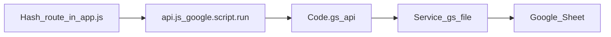

# Lamai Tourism ERP — system map

This file lists **what every screen, button, and server method does**, and where to change it. Product intent lives in [PRD.md](PRD.md). Do not put passwords or seed secrets in this file.

**Stack:** hash-routed UI in `web/` (Bootstrap 5 + Vite) builds to a single `src/Index.html`. Google Apps Script in `src/*.gs` talks to one Google Sheet. Staff open the deployed `/exec` URL.

**Build / ship**

```bash
npm run build:ui
npx clasp push --force
npx clasp deploy -i AKfycbwbknn01ow_3MA3jLijxee5hi1aQ3AsEeLjrf77czLZKxXZIpvk0a8ZV0sIQZHDoVLV
```

---

## 1. How a click becomes data



1. The browser hash (`#/today`, `#/enquiries/ENQ-0001`, …) is parsed in [`web/src/assets/js/app.js`](../web/src/assets/js/app.js) `route()`.
2. Page functions call `api(method, payload)` in [`web/src/assets/js/api.js`](../web/src/assets/js/api.js). That sends `{ method, token, payload }` to Apps Script `api()`.
3. [`src/Code.gs`](../src/Code.gs) looks up `METHOD_HANDLERS_`, checks auth, runs the handler, returns `{ ok, data }` or `{ ok: false, code, message }`.
4. Handlers read/write the Sheet through [`src/SheetRepository.gs`](../src/SheetRepository.gs).

Session token is stored in `localStorage` key `lamai.token`. Username remember uses `lamai.username`. Splash skip uses `sessionStorage` `lamaiSplashSeen`. Notification “seen” ids use `lamai.notifSeen`.

---

## 2. Files and what they own

| File | Role |
| --- | --- |
| [`web/src/index.html`](../web/src/index.html) | Chrome: splash, sidebar, topbar search, bell, avatar menu, page host |
| [`web/src/assets/js/app.js`](../web/src/assets/js/app.js) | All screens, forms, buttons, routing |
| [`web/src/assets/js/api.js`](../web/src/assets/js/api.js) | `google.script.run` wrapper |
| [`web/src/assets/js/csv.js`](../web/src/assets/js/csv.js) | Parse website-form CSV into client fields |
| [`web/src/assets/js/logo.js`](../web/src/assets/js/logo.js) | Imports the compressed logo |
| [`web/src/assets/js/sidebar.js`](../web/src/assets/js/sidebar.js) | Collapse sidebar, mobile overlay |
| [`web/src/assets/js/main.js`](../web/src/assets/js/main.js) | Boot: Bootstrap, logo, SCSS |
| [`web/src/assets/js/country-codes.js`](../web/src/assets/js/country-codes.js) | Phone country-code list |
| [`web/src/assets/scss/_variables.scss`](../web/src/assets/scss/_variables.scss) | Theme (`#a27d45` primary), button padding, semantic colours |
| [`web/src/assets/scss/_lamai.scss`](../web/src/assets/scss/_lamai.scss) | Splash, forms, pipeline list, toasts, sharp buttons |
| [`src/Code.gs`](../src/Code.gs) | `doGet` (serves UI) and `api` dispatcher |
| [`src/AppConfig.gs`](../src/AppConfig.gs) | Stages, roles, sheet column lists, company defaults, destination/style seeds |
| [`src/AuthService.gs`](../src/AuthService.gs) | Sessions, login, logout, change password, bootstrap |
| [`src/Setup.gs`](../src/Setup.gs) | First-run spreadsheet + Super Admin create |
| [`src/AdminService.gs`](../src/AdminService.gs) | Staff CRUD, password reset, settings, reference labels |
| [`src/ClientService.gs`](../src/ClientService.gs) | Guests: list/create/update/delete |
| [`src/EnquiryService.gs`](../src/EnquiryService.gs) | Trip files, dashboard, search, work, notifications |
| [`src/PaymentService.gs`](../src/PaymentService.gs) | Deposit/balance milestones |
| [`src/ReportService.gs`](../src/ReportService.gs) | Counts + Excel-friendly CSV export |
| [`src/SheetRepository.gs`](../src/SheetRepository.gs) | Spreadsheet read/upsert/delete/audit |
| [`src/DomainCommon.gs`](../src/DomainCommon.gs) | Validation, hashing, ids, `withLock_` |
| [`scripts/finalize-ui.js`](../scripts/finalize-ui.js) | Copies Vite single-file HTML into `src/Index.html` |

---

## 3. Google Sheets

Created on first Super Admin setup (`initializeWorkspace_`). Primary keys in [`AppConfig.gs`](../src/AppConfig.gs).

| Sheet | Primary key | Holds |
| --- | --- | --- |
| Users | `userId` | Login, role, work label, password hash, `sessionEpoch` |
| Clients | `clientId` | Guest contact |
| Enquiries | `enquiryId` | Trip file, stage, owner, dates, budget, next follow-up |
| Activities | `activityId` | Notes / calls / follow-ups on an enquiry |
| Payments | `paymentId` | Deposit and balance rows |
| Settings | `key` | Optional company profile keys (not shown in Settings UI) |
| ReferenceData | `itemId` | Destinations and travel styles |
| AuditLog | `auditId` | Who did what (kept when a client/staff row is deleted) |

---

## 4. Roles

- **Super Admin:** payments, reports, settings, Excel download, permanent deletes, mark paid, create staff.
- **Staff:** Today, Pipeline, Enquiries, Clients, Work, search, bell (follow-ups). They only see files they own **or** unassigned files, depending on the method (dashboard/work filter by owner; enquiry list is all non-archived for now via `listEnquiries` unless a later filter is added).

Admin-only nav items use `.admin-only` in [`index.html`](../web/src/index.html).

---

## 5. Hash routes (screens)

All routing is in `route()` in `app.js`.

| Hash | Screen function | Who | What you see |
| --- | --- | --- | --- |
| `#/today` | `renderToday` | All | Stat cards + due/overdue lists + open files table |
| `#/pipeline` | `renderPipeline` | All | Live stages as headings; files listed under each |
| `#/enquiries` | `renderEnquiryList` | All | Table of all trip files |
| `#/enquiries/new` | `renderEnquiryNew` | All | New enquiry form |
| `#/enquiries/{id}` | `renderEnquiryDetail` | All | Edit enquiry, log follow-up, payments |
| `#/clients` | `renderClients` | All | New client form, CSV import, guest list |
| `#/work` | `renderWork` | All | Due and overdue follow-ups |
| `#/payments` | `renderPayments` | Admin | All payment rows; mark received |
| `#/reports` | `renderReports` | Admin | Counts by stage + Download Excel |
| `#/settings` | `renderSettings` | Admin | Staff + destination/style labels |
| `#/change-password` | `renderChangePassword` | Signed in | Current / new / confirm password |
| `#/sign-out` | `route` | Signed in | Calls `logout`, clears token |
| (no session) | `renderSignIn` | Public | Username + password |
| (empty Users) | `renderSetup` | Public | Create first Super Admin |

---

## 6. Chrome (always on after sign-in)

Defined in [`web/src/index.html`](../web/src/index.html), wired in `bindChromeTools` / `sidebar.js`.

| Control | What it does |
| --- | --- |
| Collapse sidebar button | Toggles `.collapsed` / `.full` (`sidebar.js`) |
| Mobile menu button | Opens sidebar + overlay |
| Overlay click | Closes mobile sidebar |
| Wordmark **Lamai Safaris** | Goes to `#/today` |
| Nav: Today / Pipeline / Enquiries / Clients / Work | Hash links (`bindHashLinks` keeps them inside the Apps Script iframe) |
| Nav: Payments / Reports / Settings | Super Admin only |
| Collapsed icon hover | CSS `data-title` tooltip |
| Search box | After 2 characters, `searchWorkspace`; results jump to client/enquiry/settings |
| Bell | Dropdown of overdue, due today, unpaid (admin). Unread badge until opened |
| “Open all follow-ups” | `#/work` |
| Avatar menu | Change password, Sign out |

---

## 7. Buttons and forms by screen

### Sign-in / setup / password

| Control | Calls | Effect |
| --- | --- | --- |
| Create Super Admin | `setupSuperAdmin` | Creates spreadsheet + first user, returns session |
| Sign in | `login` | Session token; may force password change |
| Eye on password | (client only) | Show / hide field |
| Change password Save | `changePassword` | Updates hash, clears `mustChangePassword` |
| Sign out | `logout` | Drops cache session + local token |

### Today (`renderToday`)

| Control | Effect |
| --- | --- |
| Stat cards | Counts only (live / due today / overdue / payments due) |
| Follow-up / overdue names | Open enquiry |
| Open work | `#/work` |
| Open files rows | `#/enquiries/{id}` |
| New enquiry | `#/enquiries/new` |

### Pipeline (`renderPipeline`)

| Control | Effect |
| --- | --- |
| New enquiry | `#/enquiries/new` |
| A file row under a stage | `#/enquiries/{id}` |
| Empty stage | Shows “None” |

### Enquiries list

| Control | Effect |
| --- | --- |
| New enquiry | `#/enquiries/new` |
| Table row | `#/enquiries/{id}` |

### Enquiry form (new + detail)

| Control | Calls | Effect |
| --- | --- | --- |
| New guest on this page / Save guest | `createClient` | Creates guest and selects them |
| Destination pills | (form) | Multi-select destinations |
| Save | `createEnquiry` or `updateEnquiry` | Writes trip file; may auto-create payment milestones |
| Stage → Lost | Requires lost reason | |
| Follow-up Log | `createActivity` | Note + due date; can set next follow-up |
| Create deposit / balance | `generatePaymentMilestones` | 50% deposit + 90-day balance |
| Mark received | `markPaymentPaid` | Sets payment received; deposit can move stage to Confirmed |

### Clients (`renderClients`)

| Control | Calls | Effect |
| --- | --- | --- |
| Upload CSV | (browser) `mapClientCsv` | Fills the form; nothing saved until Save |
| Sample CSV | (browser) | Downloads header template |
| Previous / Next / Skip | (browser) | Walk CSV rows |
| CSV row click | (browser) | Load that row into the form |
| Save client | `createClient` | Writes Clients sheet |
| Save and file enquiry | `createClient` then `#/enquiries/new` | Prefills client |
| **Delete** (admin) | `deleteClient` | Type guest name to confirm. Removes client **and** their enquiries, activities, and payments |

### Work

| Control | Effect |
| --- | --- |
| A follow-up row | `#/enquiries/{id}` |
| Mark received (if shown) | `markPaymentPaid` |

### Payments (admin)

| Control | Calls | Effect |
| --- | --- | --- |
| Mark received | `markPaymentPaid` | Same as enquiry detail |

### Reports (admin)

| Control | Calls | Effect |
| --- | --- | --- |
| Download Excel | `exportReportCsv` | UTF-8 BOM CSV Excel opens |

### Settings (admin)

| Control | Calls | Effect |
| --- | --- | --- |
| Create account | `createUser` | Staff user + one-time password box (copy + eye) |
| Edit / Save changes | `updateUser` | Name and work label |
| Reset password | `resetStaffPassword` | New one-time password; invalidates their sessions |
| **Delete** | `deleteUser` | Type username to confirm. Removes the Users row (credentials gone). Clears `ownerId` on files they owned. **Does not** delete clients or trip files. Cannot delete Super Admin or yourself |
| Add (destination/style) | `saveReferenceItem` | Used by enquiry form pills |

Company legal/office/TIN fields were removed from this screen. Keys can still exist on the Settings sheet from earlier seeds.

---

## 8. Server methods (`Code.gs` → handler)

Auth: `PUBLIC_METHODS_` need no token. `AUTH_WITHOUT_PASSWORD_GATE_` allow a session even if `mustChangePassword` is true.

| Method | File | Auth | What it does |
| --- | --- | --- | --- |
| `getBootstrap` | AuthService | Optional session | Ensures spreadsheet schema exists; returns `needsSetup`, session, staff, references, due count |
| `setupSuperAdmin` | AuthService | Public, once | First Super Admin + sheets |
| `login` | AuthService | Public | Verifies password, creates cache session |
| `logout` | AuthService | Session optional | Removes `sess:{token}` from CacheService |
| `changePassword` | AuthService | Session (password gate skipped) | Re-hash password |
| `getDashboardData` | EnquiryService | Signed in | Live files, due, overdue, payments due |
| `listEnquiries` | EnquiryService | Signed in | Trip files; `liveOnly` skips Completed/Lost |
| `getEnquiryDetail` | EnquiryService | Signed in | Enquiry + activities + payments |
| `createEnquiry` | EnquiryService | Signed in | New trip file |
| `updateEnquiry` | EnquiryService | Signed in | Save fields / stage change |
| `transitionEnquiry` | EnquiryService | Signed in | Stage-only update (wrapper) |
| `createActivity` | EnquiryService | Signed in | Log call/note/follow-up |
| `getWorkData` | EnquiryService | Signed in | Due today + overdue |
| `searchWorkspace` | EnquiryService | Signed in | Clients, files, staff (min 2 chars) |
| `getNotificationData` | EnquiryService | Signed in | Work lists + unpaid for admin |
| `listClients` | ClientService | Signed in | Active guests |
| `getClientDetail` | ClientService | Signed in | One guest (no dedicated UI page yet) |
| `createClient` | ClientService | Signed in | New guest |
| `updateClient` | ClientService | Signed in | Edit guest (API exists; Clients page currently creates) |
| `deleteClient` | ClientService | Super Admin | Permanent cascade delete |
| `listPayments` | PaymentService | Super Admin | All payment rows |
| `generatePaymentMilestones` | PaymentService | Signed in | Deposit + balance from quoted amount |
| `markPaymentPaid` | PaymentService | Super Admin | Mark received |
| `updatePayment` | PaymentService | Super Admin | Amount/status/note (API; UI uses mark paid) |
| `getReportData` | ReportService | Super Admin | Counts |
| `exportReportCsv` | ReportService | Super Admin | CSV string + filename |
| `getAdminData` | AdminService | Super Admin | Staff list, settings map, references |
| `createUser` | AdminService | Super Admin | Staff account + one-time password |
| `updateUser` | AdminService | Super Admin | Name / work label / active flag |
| `deactivateUser` | AdminService | Super Admin | Soft disable (kept on API; UI uses delete instead) |
| `deleteUser` | AdminService | Super Admin | Permanent staff delete + unassign files |
| `resetStaffPassword` | AdminService | Super Admin | New one-time password |
| `updateSettings` | AdminService | Super Admin | Company key/value (no Settings UI now) |
| `saveReferenceItem` | AdminService | Super Admin | Destination or style label |

Internal helpers (underscore names) are not callable from the UI. Important ones:

- `ensureHarryWorkspace_` — if a spreadsheet id exists, ensure columns/seed lists; **does not wipe data and does not seed a password**
- `hashPassword_` / `verifyPassword_` — salted SHA-256, 32 rounds
- `deleteRecord_` / `deleteRecordsWhere_` / `deleteRecordsInSet_` — physical row deletes
- `recordAudit_` — append-only AuditLog

---

## 9. Permanent delete rules

**Client:** Super Admin types the guest’s full name. Deletes Clients row, then Enquiries with that `clientId`, then Activities and Payments for those enquiry ids. Writes `CLIENT_DELETED` to AuditLog.

**Staff:** Super Admin types the username. Cannot delete Super Admin or self. Deletes Users row (login gone; existing tokens fail in `getSession_` because the user is missing). Sets `ownerId` to blank on enquiries they owned. Does not delete clients or trip files. Writes `STAFF_DELETED`.

---

## 10. Where to change X

| If you want to… | Start here |
| --- | --- |
| Add a page | `index.html` nav + `route()` + a `render…` function in `app.js` + maybe a new `api` method |
| Add a Sheet column | `APP_CONFIG.SHEETS` in `AppConfig.gs` (schema is additive) |
| Change pipeline stages | `APP_CONFIG.STAGES` and the `STAGES` array in `app.js` |
| Change theme colour | `$lamai-gold` / `$primary` in `_variables.scss` |
| Change Today card colours | `statCard` tones + `$success` `$warning` `$danger` in `_variables.scss` |
| Change button size | `$input-btn-padding-y/x` and `.btn-sm` in `_lamai.scss` |
| Change logo | `web/src/assets/images/lamai-logo.jpg` then `npm run build:ui` |
| Change CSV column mapping | `HEADER_MAP` in `csv.js` |
| Change search | `searchWorkspace` in `EnquiryService.gs` |
| Change report columns | `exportReportCsv` in `ReportService.gs` |
| Tighten staff data visibility | Filters in `listEnquiries` / `getDashboardData` / `getWorkData` |

---

## 11. UI helpers in `app.js` (not screens)

| Function | Role |
| --- | --- |
| `escapeHtml` | Safe HTML text |
| `formatDate` | First 10 chars of ISO dates |
| `isAdmin` | Session role Super Admin |
| `notify` / `showAlert` | Toasts / page alerts |
| `setBusy` | Button spinner |
| `showPageLoading` | “Loading…” in `#page` |
| `passwordField` / `bindPasswordToggles` | Eye show/hide |
| `credentialsBox` / `bindCopyButtons` | One-time password copy |
| `confirmTypedDelete` | Type-to-confirm deletes |
| `statCard` | Today/Reports metric tiles |
| `enquiryForm` / `readEnquiryForm` / `wireEnquiryForm` | Enquiry editor |
| `fillClientForm` / `renderCsvPreview` / `stepCsv` | CSV walk-through |
| `playSplash` | Short logo splash (skipped after first visit in the tab) |
| `go` / `parseHash` / `bindHashLinks` | In-iframe navigation |
| `renderNoticePanel` / `refreshNotifications` | Bell dropdown |
