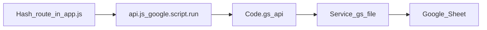

# Lamai Tourism ERP — system map

This file lists **what every screen, button, and server method does**, and where to change it. Product intent lives in [PRD.md](PRD.md). Do not put passwords or seed secrets in this file.

**Stack:** hash-routed UI in `web/` (Bootstrap 5 + Vite) builds to a single `src/Index.html`. Google Apps Script in `src/*.gs` talks to one Google Sheet. Staff open the **GitHub Pages** root URL (iframe host in [`index.html`](../index.html)); the Apps Script `/exec` URL remains the backend UI source.

**Build / ship**

```bash
npm run build:ui
npx clasp push --force
npx clasp deploy -i AKfycbwbknn01ow_3MA3jLijxee5hi1aQ3AsEeLjrf77czLZKxXZIpvk0a8ZV0sIQZHDoVLV
```

**Staff host (hide Apps Script banner):** GitHub **Settings → Pages** → Deploy from branch **`main`** / **`/` (root)**. Open `https://<user-or-org>.github.io/<repo>/`. Direct `/exec` still works but may show Google’s attribution banner.
---

## 1. How a click becomes data



1. The browser hash (`#/today`, `#/enquiries/ENQ-0001`, …) is parsed in [`web/src/assets/js/app.js`](../web/src/assets/js/app.js) `route()`.
2. Page functions call `api(method, payload)` in [`web/src/assets/js/api.js`](../web/src/assets/js/api.js). That sends `{ method, token, payload }` to Apps Script `api()`.
3. [`src/Code.gs`](../src/Code.gs) looks up `METHOD_HANDLERS_`, checks auth, runs the handler, returns `{ ok, data }` or `{ ok: false, code, message }`.
4. Handlers read/write the Sheet through [`src/SheetRepository.gs`](../src/SheetRepository.gs).

Session token is stored in `localStorage` key `lamai.token`. Username remember uses `lamai.username`. Splash skip uses `sessionStorage` `lamaiSplashSeen`. Notification “seen” ids use `lamai.notifSeen`.

---

## 2. Files and what they own

| File | Role |
| --- | --- |
| [`web/src/index.html`](../web/src/index.html) | Chrome: splash, sidebar, topbar search, bell, avatar menu, page host |
| [`web/src/assets/js/app.js`](../web/src/assets/js/app.js) | All screens, forms, buttons, routing |
| [`web/src/assets/js/api.js`](../web/src/assets/js/api.js) | `google.script.run` wrapper |
| [`web/src/assets/js/csv.js`](../web/src/assets/js/csv.js) | Parse website-form CSV into client fields |
| [`web/src/assets/js/logo.js`](../web/src/assets/js/logo.js) | Imports the compressed logo |
| [`web/src/assets/js/sidebar.js`](../web/src/assets/js/sidebar.js) | Collapse sidebar, mobile overlay |
| [`web/src/assets/js/main.js`](../web/src/assets/js/main.js) | Boot: Bootstrap, logo, SCSS |
| [`web/src/assets/js/country-codes.js`](../web/src/assets/js/country-codes.js) | Phone country-code list |
| [`web/src/assets/scss/_variables.scss`](../web/src/assets/scss/_variables.scss) | Theme (`#a27d45` primary), button padding, semantic colours |
| [`web/src/assets/scss/_lamai.scss`](../web/src/assets/scss/_lamai.scss) | Splash, forms, pipeline list, toasts, sharp buttons |
| [`src/Code.gs`](../src/Code.gs) | `doGet` (serves UI) and `api` dispatcher |
| [`src/AppConfig.gs`](../src/AppConfig.gs) | Stages, roles, sheet column lists, company defaults, destination/style seeds |
| [`src/AuthService.gs`](../src/AuthService.gs) | Sessions, login, logout, change password, bootstrap |
| [`src/Setup.gs`](../src/Setup.gs) | First-run spreadsheet + Super Admin create |
| [`src/AdminService.gs`](../src/AdminService.gs) | Staff CRUD, password reset, settings, reference labels |
| [`src/ClientService.gs`](../src/ClientService.gs) | Guests: list/create/update/delete |
| [`src/EnquiryService.gs`](../src/EnquiryService.gs) | Trip files, dashboard, search, work, notifications |
| [`src/PaymentService.gs`](../src/PaymentService.gs) | Deposit/balance milestones |
| [`src/HandoverService.gs`](../src/HandoverService.gs) | Department handovers + acknowledgement |
| [`src/PermissionService.gs`](../src/PermissionService.gs) | Role IDs, module/action/field maps, record scope |
| [`src/ReportService.gs`](../src/ReportService.gs) | Counts + Excel-friendly CSV export |
| [`src/SheetRepository.gs`](../src/SheetRepository.gs) | Spreadsheet read/upsert/delete/audit |
| [`src/DomainCommon.gs`](../src/DomainCommon.gs) | Validation, hashing, ids, `withLock_` |
| [`scripts/finalize-ui.js`](../scripts/finalize-ui.js) | Copies Vite single-file HTML into `src/Index.html` |

---

## 3. Google Sheets

Created on first Super Admin setup (`initializeWorkspace_`). Primary keys in [`AppConfig.gs`](../src/AppConfig.gs).

| Sheet | Primary key | Holds |
| --- | --- | --- |
| Users | `userId` | Login, role, work label, password hash, `sessionEpoch` |
| Clients | `clientId` | Guest contact |
| Enquiries | `enquiryId` | Trip file, PDF stage, department, priority, status, booking ref, owner, dates, budget, next follow-up |
| Activities | `activityId` | Diary entries (type, summary, department, outcome, next action, due) |
| Handovers | `handoverId` | Department handovers (from/to, reason, handed by/to, ack status) |
| Payments | `paymentId` | Deposit and balance rows |
| Settings | `key` | Company profile keys (editable in Settings UI) |
| ReferenceData | `itemId` | Destinations and travel styles |
| AuditLog | `auditId` | Who did what (kept when a client/staff row is deleted) |

**Pipeline stages (PDF):** New enquiry → Quoting → Follow-up → Accepted → Confirmed booking → Reservations in progress → Supplier booking completed → Awaiting payment → Paid → Operations in progress → Travel completed → Closed → Archived.

**Departments:** Sales, Reservations, Accounts, Operations (auto-set from stage). Live stages exclude Closed and Archived.

**Work labels:** Sales, Reservations, Accounts, Operations, Guide.

---

## 4. Roles

Five operational role IDs (see [RBAC.md](RBAC.md)):

- **ADMIN** (`Super Admin`): all modules including Settings; company-wide dashboard.
- **SALES** (Staff + work label Sales): create enquiries, sales fields, sales pipeline widgets; payment status summary only.
- **RESERVATIONS**: supplier/booking fields; reservations widgets; no finance edits.
- **ACCOUNTS**: payments list, mark paid, finance fields; no Settings.
- **OPERATIONS** (also Guide label): operations notes/completion; no finance edits.

Access is enforced in [`PermissionService.gs`](../src/PermissionService.gs) (modules, actions, record scope, field masks). Nav uses `data-module` attributes, not `.admin-only`.

---

## 5. Hash routes (screens)

All routing is in `route()` in `app.js`.

| Hash | Screen function | Who | What you see |
| --- | --- | --- | --- |
| `#/today` | `renderToday` | All | Role-aware widgets (own files, handovers, dept KPIs) |
| `#/pipeline` | `renderPipeline` | All | Stages for the user’s department band |
| `#/enquiries` | `renderEnquiryList` | All | Scoped trip files |
| `#/enquiries/new` | `renderEnquiryNew` | Sales/Admin | New enquiry form |
| `#/enquiries/{id}` | `renderEnquiryDetail` | Scoped | Edit (field-masked), diary, handovers, payments |
| `#/clients` | `renderClients` | All | Guest list / create (edit: Sales/Admin) |
| `#/clients/{id}` | `renderClients` | Sales/Admin edit | Edit existing guest |
| `#/work` | `renderWork` | All | Due and overdue follow-ups (scoped) |
| `#/handovers` | `renderHandovers` | All | Incoming/outgoing handovers |
| `#/archive` | `renderArchive` | All | Closed/archived files in scope |
| `#/payments` | `renderPayments` | Admin/Accounts | Payment rows; mark received |
| `#/reports` | `renderReports` | All (scoped) | Period filters + department KPIs + CSV |
| `#/settings` | `renderSettings` | Admin only | Company profile, staff, reference labels |
| `#/change-password` | `renderChangePassword` | Signed in | Current / new / confirm password |
| `#/sign-out` | `route` | Signed in | Centered **Signing out…**, then `logout` + clear token |
| (no session) | `renderSignIn` | Public | Username + password |
| (empty Users) | `renderSetup` | Public | Create first Super Admin |

---

## 6. Chrome (always on after sign-in)

Defined in [`web/src/index.html`](../web/src/index.html), wired in `bindChromeTools` / `sidebar.js`.

| Control | What it does |
| --- | --- |
| Collapse sidebar button | Toggles `.collapsed` / `.full` (`sidebar.js`) |
| Mobile menu button | Opens sidebar + overlay |
| Overlay click | Closes mobile sidebar |
| Wordmark **Lamai Safaris** | Goes to `#/today` |
| Nav: Today / Pipeline / Enquiries / Clients / Work | Hash links (`bindHashLinks` keeps them inside the Apps Script iframe) |
| Nav: Payments / Reports / Settings | Role-gated via `data-module` + permissions |
| Collapsed icon hover | CSS `data-title` tooltip |
| Search box | After 2 characters (300ms debounce), `searchWorkspace`; results jump to client/enquiry/settings |
| Bell | Dropdown of overdue, due today, unpaid (admin), pending handovers. Unread badge until opened |
| “Open all follow-ups” | `#/work` |
| Avatar menu | Change password, Sign out |

---

## 7. Buttons and forms by screen

### Sign-in / setup / password

| Control | Calls | Effect |
| --- | --- | --- |
| Create Super Admin | `setupSuperAdmin` | Creates spreadsheet + first user, returns session |
| Sign in | `login` | Session token; may force password change |
| Eye on password | (client only) | Show / hide field |
| Change password Save | `changePassword` | Updates hash, clears `mustChangePassword` |
| Sign out | `logout` | Drops cache session + local token |

### Today (`renderToday`)

| Control | Effect |
| --- | --- |
| Stat cards | Live / due / overdue / handovers + by department, confirmed, completed, revenue, payments |
| Follow-up / overdue names | Open enquiry |
| Acknowledge handover | `acknowledgeHandover` |
| Open work | `#/work` |
| Open files rows | `#/enquiries/{id}` |
| New enquiry | `#/enquiries/new` |

### Pipeline (`renderPipeline`)

| Control | Effect |
| --- | --- |
| New enquiry | `#/enquiries/new` |
| A file row under a stage | `#/enquiries/{id}` |
| Empty stage | Shows “None” |

### Enquiries list

| Control | Effect |
| --- | --- |
| New enquiry | `#/enquiries/new` |
| Table row | `#/enquiries/{id}` |

### Enquiry form (new + detail)

| Control | Calls | Effect |
| --- | --- | --- |
| New guest on this page / Save guest | `createClient` | Creates guest and selects them |
| Destination pills | (form) | Multi-select destinations |
| Save | `createEnquiry` or `updateEnquiry` | Writes trip file; department from stage; may auto-create payment milestones; department change creates handover |
| Stage → Closed / Archived | Requires close reason; Archived also sets `archived=true` | |
| Diary Log | `createActivity` | Summary + department + outcome + next action + due |
| Record handover | `createHandover` | From/to department, handed to, reason |
| Acknowledge handover | `acknowledgeHandover` | Marks ack status |
| Create deposit / balance | `generatePaymentMilestones` | 50% deposit + 90-day balance |
| Mark received | `markPaymentPaid` | Sets payment received; can advance stage toward Paid |

### Clients (`renderClients`)

| Control | Calls | Effect |
| --- | --- | --- |
| Upload CSV | (browser) `mapClientCsv` | Fills the form; nothing saved until Save |
| Sample CSV | (browser) | Downloads header template |
| Previous / Next / Skip | (browser) | Walk CSV rows |
| CSV row click | (browser) | Load that row into the form |
| Save client | `createClient` or `updateClient` | Writes Clients sheet |
| Edit link / `#/clients/{id}` | `getClientDetail` | Prefills edit form |
| Save and file enquiry | save then `#/enquiries/new` | Prefills client |
| **Delete** (admin) | `deleteClient` | Type guest name to confirm. Removes client **and** their enquiries, activities, payments, and handovers |

### Work

| Control | Effect |
| --- | --- |
| A follow-up row | `#/enquiries/{id}` |
| Mark received (if shown) | `markPaymentPaid` |

### Payments (admin)

| Control | Calls | Effect |
| --- | --- | --- |
| Mark received | `markPaymentPaid` | Same as enquiry detail |

### Reports

| Control | Calls | Effect |
| --- | --- | --- |
| Period / date / department / staff / stage / status | (filters) | Staff department is read-only; Admin may choose one dept or All |
| Generate | `generateDepartmentReport` | Header, KPIs, exceptions, files, handovers, diary |
| Download Excel | `exportReportCsv` | Same filters as last generated report (UTF-8 BOM CSV) |

### Settings (admin)

| Control | Calls | Effect |
| --- | --- | --- |
| Save company profile | `updateSettings` | Legal name, office, phone, email, TIN, postal, timezone |
| Create account | `createUser` | Staff user + one-time password box (copy + eye) |
| Edit / Save changes | `updateUser` | Name and work label |
| Reset password | `resetStaffPassword` | New one-time password; invalidates their sessions |
| **Delete** | `deleteUser` | Type username to confirm. Removes the Users row (credentials gone). Clears `ownerId` on files they owned. **Does not** delete clients or trip files. Cannot delete Super Admin or yourself |
| Add (destination/style) | `saveReferenceItem` | Used by enquiry form pills |

---

## 8. Server methods (`Code.gs` → handler)

Auth: `PUBLIC_METHODS_` need no token. `AUTH_WITHOUT_PASSWORD_GATE_` allow a session even if `mustChangePassword` is true.

| Method | File | Auth | What it does |
| --- | --- | --- | --- |
| `getBootstrap` | AuthService | Optional session | Schema ensure throttled via CacheService; returns session, **permissions**, staff, references, cached due count |
| `setupSuperAdmin` | AuthService | Public, once | First Super Admin + sheets |
| `login` | AuthService | Public | Verifies password, creates cache session |
| `logout` | AuthService | Session optional | Removes `sess:{token}` from CacheService |
| `changePassword` | AuthService | Session (password gate skipped) | Re-hash password |
| `getDashboardData` | EnquiryService | Signed in | KPIs + capped action queues (≈15) and file table (≈25) |
| `listEnquiries` | EnquiryService | Signed in | Scoped trip files; `liveOnly` / `includeArchived` / `limit` / `offset` |
| `listArchivedEnquiries` | EnquiryService | Signed in | Closed/archived files in scope |
| `getEnquiryDetail` | EnquiryService | Signed in | Enquiry + activities + masked payments + handovers |
| `createEnquiry` | EnquiryService | Signed in | New trip file |
| `updateEnquiry` | EnquiryService | Signed in | Save fields / stage change; auto handover on department change |
| `transitionEnquiry` | EnquiryService | Signed in | Stage-only update (wrapper) |
| `createActivity` | EnquiryService | Signed in | Diary entry |
| `getWorkData` | EnquiryService | Signed in | Due today + overdue |
| `searchWorkspace` | EnquiryService | Signed in | Clients, files (incl. archived), staff (min 2 chars) |
| `getNotificationData` | EnquiryService | Signed in | Work lists + unpaid (admin) + pending handovers |
| `listHandovers` | HandoverService | Signed in | Handovers for a file or pending list |
| `createHandover` | HandoverService | Signed in | Manual department handover |
| `acknowledgeHandover` | HandoverService | Signed in | Mark handover acknowledged |
| `listClients` | ClientService | Signed in | Active guests |
| `getClientDetail` | ClientService | Signed in | One guest |
| `createClient` | ClientService | Signed in | New guest |
| `updateClient` | ClientService | Signed in | Edit guest |
| `deleteClient` | ClientService | Super Admin | Permanent cascade delete |
| `listPayments` | PaymentService | Admin/Accounts | Payment rows |
| `generatePaymentMilestones` | PaymentService | Admin/Accounts/Sales | Deposit + balance from quoted amount |
| `markPaymentPaid` | PaymentService | Admin/Accounts | Mark received; may advance stage |
| `updatePayment` | PaymentService | Admin/Accounts | Amount/status/note |
| `getReportData` | ReportService | Role reports | Snapshot counts (legacy summary) |
| `generateDepartmentReport` | ReportService | Role reports | Daily/weekly/monthly department report payload |
| `exportReportCsv` | ReportService | Role reports | CSV for department report filters (or legacy snapshot) |
| `getAdminData` | AdminService | Super Admin | Staff list, settings map, references |
| `createUser` | AdminService | Super Admin | Staff account + one-time password |
| `updateUser` | AdminService | Super Admin | Name / work label / active flag |
| `deactivateUser` | AdminService | Super Admin | Soft disable (kept on API; UI uses delete instead) |
| `deleteUser` | AdminService | Super Admin | Permanent staff delete + unassign files |
| `resetStaffPassword` | AdminService | Super Admin | New one-time password |
| `updateSettings` | AdminService | Super Admin | Company profile key/value |
| `saveReferenceItem` | AdminService | Super Admin | Destination or style label |

Internal helpers (underscore names) are not callable from the UI. Important ones:

- `ensureHarryWorkspace_` — schema ensure throttled (~10 min CacheService flag); **does not wipe data**
- `clearRequestCaches_` — per-RPC sheet memo cleared at start of `api()`
- `readAllRecords_` — memoized per request; includes last data row
- `hashPassword_` / `verifyPassword_` — salted SHA-256, 32 rounds
- `deleteRecord_` / `deleteRecordsWhere_` / `deleteRecordsInSet_` — physical row deletes
- `recordAudit_` — append-only AuditLog

---

## 9. Performance notes

- **Request memo:** each `api()` call clears `_requestSheetCache_`; a sheet is read at most once per RPC.
- **Config cache:** Settings and ReferenceData use CacheService (~5 min); invalidated on `updateSettings` / `saveReferenceItem`.
- **Due count:** cached ~2 min; cleared when enquiries/follow-ups change.
- **Schema ensure:** skipped when `cfg:schemaOk` is set; forced on login/setup or `getBootstrap({ forceSchema: true })`.
- **Client:** bootstrap is held in session memory and not re-fetched on every hash change.
- **UX:** page loads use a centered spinner (`.lamai-loading`); sign-out shows **Signing out…** before redirect.

---

## 10. Permanent delete rules

**Client:** Super Admin types the guest’s full name. Deletes Clients row, then Enquiries with that `clientId`, then Activities, Payments, and Handovers for those enquiry ids. Writes `CLIENT_DELETED` to AuditLog.

**Staff:** Super Admin types the username. Cannot delete Super Admin or self. Deletes Users row (login gone; existing tokens fail in `getSession_` because the user is missing). Sets `ownerId` to blank on enquiries they owned. Does not delete clients or trip files. Writes `STAFF_DELETED`.

---

## 11. Where to change X

| If you want to… | Start here |
| --- | --- |
| Add a page | `index.html` nav + `route()` + a `render…` function in `app.js` + maybe a new `api` method |
| Add a Sheet column | `APP_CONFIG.SHEETS` in `AppConfig.gs` (schema is additive) |
| Change pipeline stages | `APP_CONFIG.STAGES` / `STAGE_DEPARTMENT` and the `STAGES` array in `app.js` |
| Change theme colour | `$lamai-gold` / `$primary` in `_variables.scss` |
| Change Today card colours | `statCard` tones + `$success` `$warning` `$danger` in `_variables.scss` |
| Change button size | `$input-btn-padding-y/x` and `.btn-sm` in `_lamai.scss` |
| Change logo | `web/src/assets/images/lamai-logo.svg` then `npm run build:ui` |
| Change CSV column mapping | `HEADER_MAP` in `csv.js` |
| Change search | `searchWorkspace` in `EnquiryService.gs` |
| Change report columns | `generateDepartmentReport` / `exportReportCsv` in `ReportService.gs` (see [`REPORTS.md`](REPORTS.md)) |
| Tighten staff data visibility | Filters in `listEnquiries` / `getDashboardData` / `getWorkData` |

---

## 12. UI helpers in `app.js` (not screens)

| Function | Role |
| --- | --- |
| `escapeHtml` | Safe HTML text |
| `formatDate` | First 10 chars of ISO dates |
| `isAdmin` | Session role Super Admin |
| `notify` / `showAlert` | Toasts / page alerts |
| `setBusy` | Button spinner |
| `showPageLoading` | “Loading…” in `#page` |
| `passwordField` / `bindPasswordToggles` | Eye show/hide |
| `credentialsBox` / `bindCopyButtons` | One-time password copy |
| `confirmTypedDelete` | Type-to-confirm deletes |
| `statCard` | Today/Reports metric tiles |
| `enquiryForm` / `readEnquiryForm` / `wireEnquiryForm` | Enquiry editor |
| `fillClientForm` / `renderCsvPreview` / `stepCsv` | CSV walk-through |
| `playSplash` | Short logo splash (skipped after first visit in the tab) |
| `go` / `parseHash` / `bindHashLinks` | In-iframe navigation |
| `renderNoticePanel` / `refreshNotifications` | Bell dropdown |
